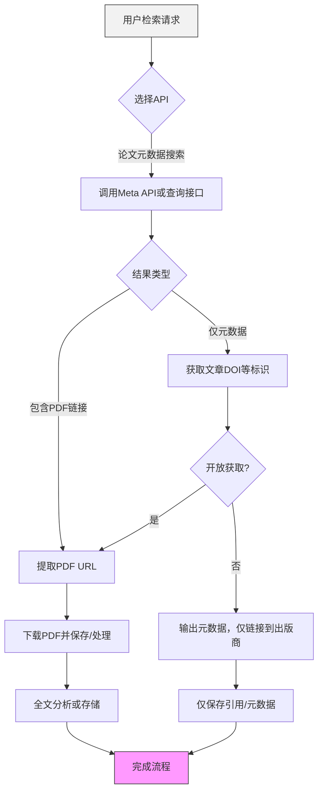

# 外部学术论文库API调研报告

## 执行摘要

本文对主流学术论文库的公开API进行了深入调研，重点评估每个API对论文PDF的获取能力及提供的元数据、使用限制等要素。涵盖资源包括arXiv、PubMed/Entrez、CrossRef、Unpaywall、CORE、Semantic Scholar、IEEE Xplore、ACM数字图书馆、Springer Nature、Elsevier/ScienceDirect、Wiley、JSTOR、ResearchGate、Google学术和OpenAIRE等。调研发现，各API在可下PDF、认证方式、速率、返回字段等方面存在显著差异。例如，**arXiv API**直接在Atom Feed中提供PDF下载链接，无需认证；**Unpaywall API**可通过DOI检索开放获取全文链接，但需提供`email`参数；**CORE API**可返回多达40M篇开放论文的完整元数据和PDF下载URL（需免费API密钥认证）；**Semantic Scholar API**在返回的JSON中提供`openAccessPdf`字段（含PDF链接）和丰富的引用元数据；**IEEE Xplore API**可检索600万篇文档元数据，并在结果中返回`pdf_url`字段，但直接获取全文需拥有订阅权限。同时，还对**CrossRef REST API**、**Springer Nature API**（元数据API、开放访问全文API、全文检索API）等进行评估，并说明了各自的认证机制（如API Key、OAuth、IP白名单等）、速率限制、商业使用许可、数据格式、示例请求和可用的SDK等。报告中提供了各API示例请求与响应片段（多为JSON或XML）并明确标注可否直接获取PDF。为易于对比，文末附上一张比较表，汇总了各API在可下载PDF、认证方式、速率限制、主要元数据字段、商业可用性等关键属性的异同。最后给出法律版权注意事项与合规建议，包括尊重内容提供方许可、避免非授权大规模抓取等。若适用，还提供了一个 Mermaid 流程图，示意从检索到获取PDF的典型工作流。所有信息均参考官方文档和权威开发者资料。

## 比较概览表

| API 名称           | PDF 可下（方式）          | 认证/授权                   | 速率限制             | 主要元数据字段                                    | 商业使用（许可）           | 备注                          |
|-------------------|-------------------------|----------------------------|--------------------|------------------------------------------------|---------------------------|-----------------------------|
| arXiv             | 是（公开链接）           | 无需认证                    | 建议<=1次/3秒        | 标题、作者、摘要、arXiv ID、出版日期、更新日期、类别、DOI、引用等 | 免费、公开（open license） | 返回Atom/XML格式   |
| PubMed/Entrez     | 否（仅元数据）           | API Key可选提升速率         | ~3次/秒（无Key）≈10次/秒（有Key） | 标题、作者、摘要、期刊、年份、PMID、DOI、MeSH等   | 公共领域（免费）           | 返回XML或JSON（esummary）  |
| CrossRef REST     | 部分（有时含PDF链接）     | 无需认证（建议加mailto）    | 建议≤50次/秒 (礼貌访问) | 标题、作者、期刊、DOI、出版信息、引用数、基金、许可证、参考文献列表等 | 免费（CC0元数据）         | JSON，示例：`/works/{DOI}` |
| Unpaywall        | 是（提供OA PDF链接）     | `email`参数（免费）         | 基础：10次/分，日限1k；可升级至100次/分 | DOI、开放获取状态、最佳OA地点（含`url_for_pdf`）、许可证等 | 数据为开放许可           | JSON，示例：`/v2/DOI?email=...` |
| CORE              | 是（含下载URL）         | 免费API Key（Bearer令牌）   | 免费：约5次/10秒 | 标题、作者、摘要、DOI、期刊、出版日期、字段、引用数、类型、语言、`downloadUrl` | 研究非商用免费，商用需付费 | JSON，覆盖300M+开放论文 |
| Semantic Scholar  | 是（`openAccessPdf`字段）| 可选API Key（可提升限额）    | 键控：100次/5分（无Key时更低） | 标题、作者、摘要、引用数、影响力引用数、引用列表、参考文献、所属领域、开放获取标志、`openAccessPdf`链接 | 免费（数据免费）         | JSON，示例：`/graph/v1/paper/{ID}?fields=...` |
| IEEE Xplore       | 是（`pdf_url`字段）     | 注册获取API Key             | 未公开（订阅用户）   | 标题、作者、摘要、DOI、出版物信息、年份、页码、会议/期刊、引用数、`html_url`、`pdf_url`等 | 订阅制（商业需要许可）    | XML/JSON，须订阅获取全文 |
| ACM Digital Library | 否（仅HTML检索）         | 可选ACM会员登录            | 采用HTML SRU，不公开 | 标题、作者、期刊/会议、年份、DOI、摘要（需登录）、等 | 仅限非商用             | 返回HTML；需要解析网页，无法直接通过API下载PDF |
| Springer Nature   | 是（视权限而定）         | API Key（订阅）            | 未公开（依订阅级别） | 标题、作者、DOI、期刊、卷号、期号、年份、摘要、关键词、基金、许可证等（Meta API） | 订阅制（付费）          | 提供Meta API/Full Text API/Open Access API，支持文本挖掘 |
| Elsevier (ScienceDirect) | 是（需订阅或OA）       | API Key + InstToken          | 一般10次/秒（免费key） | 标题、作者、DOI、期刊、卷期、页码、摘要、关键词、引用数、Open Access标志等 | 学术免费，商业需订阅     | JSON/XML；`/content/search/sciencedirect`等端点 |
| Wiley (Federated Search) | 是（含全文链接）         | 无需API Key（机构IP白名单）  | 速率未明             | 标题、作者、期刊、年份、DOI、摘要（符合订阅权限）、全文链接 | 免费（限搜索集成）       | 使用SRU协议（REST查询），返回XML；无需注册 |
| JSTOR            | 有限（**JSTOR Data for Research**） | DfR账号                 | 未公开             | 标题、作者、出版信息、年份、关键词、参考文献（部分）、OCR全文等 | 需通过JSTOR DfR平台     | 主要通过DfR批量下载，需申请 |
| ResearchGate     | 否（无官方API）         | 无                        | —                    | —                                              | 不允许爬取             | 无公开API；只能人工或爬虫访问（违法风险高） |
| Google Scholar   | 否（无官方API）         | 无                        | —                    | —                                              | 禁止大量抓取           | 无公开API；可借助非官方工具，需注意Google政策 |
| OpenAIRE         | 是（Graph API/OpenAIRE Search） | 无需认证（部分需token）    | ~100 req/s           | 标题、作者、DOI、期刊、基金、数据集关联、论文与项目元数据等 | 数据开放（遵守European policies） | 提供Graph API（/v3/research-products）和ScholeXplorer等，JSON返回全文信息 |

## 详细API分析

### ArXiv API

- **官方名称/提供方**：arXiv API，由康奈尔大学提供。官方文档见 [arXiv API Basics](https://info.arxiv.org/help/api/)。
- **PDF下载支持**：支持。arXiv API返回Atom/XML格式的文章条目，每条目中含有指向PDF的链接。如：
  ```xml
  <entry>
    <title>Example Title</title>
    ...
    <link title="pdf" href="http://arxiv.org/pdf/XXXXXXXXv1" rel="related" type="application/pdf"/>
    ...
  </entry>
  ```
  其中 `href` 即可直接下载PDF，无需认证。下载方式为通过公开URL访问arXiv服务器。
- **元数据字段**：API结果包含题目、摘要、作者（含姓名和隶属）、发表日期、更新日期、arXiv ID、DOI（若有）、期刊引用(`journal_ref`)、作者自评注释(`comment`)、学科类别等。返回示例（Atom格式）:
  ```xml
  <entry>
    <title>Quantum Entanglement</title>
    <id>http://arxiv.org/abs/xxxx.xxxxv1</id>
    <updated>2026-01-15T12:34:56Z</updated>
    <published>2026-01-10T00:00:00Z</published>
    <author><name>Alice</name><arxiv:affiliation>Univ X</arxiv:affiliation></author>
    <summary>Abstract text...</summary>
    <arxiv:doi>10.1234/abc</arxiv:doi>
    <link title="pdf" href="http://arxiv.org/pdf/xxxx.xxxxv1" rel="related" type="application/pdf"/>
    ...
  </entry>
  ```
- **认证授权**：无需认证/API Key。公开可用，遵循arXiv使用条款。
- **速率限制/配额**：文档建议每次API调用至少间隔3秒以礼貌访问（每秒限约0.3次）；单次查询最多返回30000条（需要分页，每页至多2000条）。
- **商业与再分发**：arXiv内容大多允许学术使用，需注明arXiv来源。其许可由作者指定（可在网页查看）。按照CC-BY或类似协议的文章可商用，版权受限的需遵守原出版者许可。再分发须保留链接与引用，不可违规售卖原文。
- **查询能力**：支持按全文(`all:`)、作者(`au:`)、标题(`ti:`)、摘要(`abs:`)等字段检索。例如：
  ```
  GET http://export.arxiv.org/api/query?search_query=ti:quantum+entanglement&start=0&max_results=10
  ```
  支持布尔运算和多字段查询，返回Atom XML。示例响应包含上文所示条目。
- **返回格式**：Atom 1.0 (XML)。示例请求：
  ```http
  GET http://export.arxiv.org/api/query?search_query=all:electron&max_results=1
  ```
  示例响应片段（经过简化）：
  ```xml
  <feed xmlns="http://www.w3.org/2005/Atom" xmlns:arxiv="http://arxiv.org/schemas/atom">
    <entry>
      <title>Electron Behavior</title>
      <id>http://arxiv.org/abs/hep-ex/0307015v1</id>
      <summary>We investigate electron motion...</summary>
      <link title="pdf" href="http://arxiv.org/pdf/hep-ex/0307015v1" rel="related" type="application/pdf"/>
      <arxiv:doi>10.1103/PhysRevLett.30.1234</arxiv:doi>
      ...
    </entry>
  </feed>
  ```
  中可见`<link title="pdf" ...>`字段提供PDF链接。
- **SDK/客户端**：无官方SDK，但有第三方包（如Python的`sickle`、`arxivpy`等）。目前仅需HTTP请求即可使用。
- **覆盖范围**：收录物理、数学、计算机科学等领域的预印本。主要为预印本论文，不包括期刊正式版本（后者可能在`journal_ref`中给出）。
- **全文结构化**：仅返回摘要，不解析章节或参考文献。需自行爬取(arXiv网页)或使用astro核心库获得参考文献。
- **成本模型**：免费。
- **隐私/合规**：返回纯公开科研元数据，不涉及敏感用户信息；arXiv自托管，无GDPR限制问题。版权遵循文章所附许可（一般需保留作者信息）。※**建议**：限制查询频率，避免过度调用。

### PubMed/Entrez (NCBI E-utilities)

- **官方名称/提供方**：NCBI 的 Entrez 编程实用工具（E-utilities），提供PubMed及其他数据库访问。官方文档见NCBI。
- **PDF下载支持**：**不直接支持下载PDF**。PubMed数据库仅含文献元数据（题名、摘要等），无全文链接。对于收录在PubMed Central (PMC, NIH开放存取) 的文章，可通过PMC ID查询获得全文（PMC提供XML/HTML，但PDF需单独下载）。简言之，PubMed API自身不提供PDF链接。
- **元数据字段**：包括文章标题(`ArticleTitle`)、作者列表（`AuthorList`）、摘要(`Abstract`)、期刊名、出版日期、PMID、DOI、出版物信息（卷、期、页）等。部分生物医学信息如MeSH词、出版类型、引用数等也可返回。以EFetch XML为例（示例）：
  ```xml
  <PubmedArticle>
   <MedlineCitation>
    <PMID>12345678</PMID>
    <Article>
      <ArticleTitle>Example Title</ArticleTitle>
      <Abstract><AbstractText Label="BACKGROUND">Background text...</AbstractText></Abstract>
      <AuthorList>
        <Author>
          <LastName>Smith</LastName><ForeName>John</ForeName><Affiliation>Univ X</Affiliation>
        </Author>
        ...
      </AuthorList>
      <Journal>
        <ISOAbbreviation>J Med Res</ISOAbbreviation>
        <JournalIssue><PubDate><Year>2025</Year></PubDate></JournalIssue>
      </Journal>
      <ELocationID EIdType="doi">10.1000/jmr.2025.01.001</ELocationID>
    </Article>
   </MedlineCitation>
   ...
  </PubmedArticle>
  ```
- **认证授权**：无需认证，但可提供`api_key`以提高调用配额。NCBI建议包含联系邮箱(`&tool=`或`&email=`参数)并限制请求频率。
- **速率限制/配额**：无Key时每秒约3次调用，有Key时可增至10次/秒（NCBI官方建议）。每日请求总量也有限制，参见NCBI政策。大量数据可使用Entrez Direct (EDirect)命令行工具或PMC OAI等服务。
- **商业使用**：NCBI内容属于公共领域，可用于商业项目，但需遵守NCBI使用条款，不得进行恶意抓取。PMC OA文章可商用，需留意原始版权声明。NCBI/NIH强调公开访问，推荐低速抓取和非高峰期使用。
- **查询能力**：提供强大的检索和过滤。常用接口包括：
  - **ESearch**: 按关键字或字段检索返回PMID列表。例如 `https://eutils.ncbi.nlm.nih.gov/entrez/eutils/esearch.fcgi?db=pubmed&term=machine+learning&retmax=5` 。
  - **ESummary**: 获取一组PMID的简要元数据。可返回JSON(`&retmode=json`)或XML格式摘要。
  - **EFetch**: 获取完整记录（包括摘要、作者等详细字段），默认返回XML。亦可请求PubMed Central（`db=pmc`）来获得XML全文或PDF链接。
- **返回格式**：XML或JSON。比如使用ESummary JSON:
  ```http
  GET https://eutils.ncbi.nlm.nih.gov/entrez/eutils/esummary.fcgi?db=pubmed&id=31452104&retmode=json
  ```
  示例响应（JSON）包含字段如`Title`、`PubDate`、`FullJournalName`、`Authors`等。EFetch返回的XML见上文。
- **SDK/客户端**：Biopython、Pymed、entrezpy 等库可简化调用。NCBI也提供EDirect工具方便批量下载。
- **覆盖范围**：生物医学领域的期刊论文，涵盖PubMed/MEDLINE索引，以及PubMed Central的OA文章。也可访问MeSH、PMC、PubChem等NCBI数据库。
- **全文结构**：PubMed提供摘要；PMC的EFetch支持检索XML全文。PMC XML结构详细包括章节、参考文献、图表标注等。对APA式排版敏感，数据需要遵循PMC的Copyright。
- **成本模型**：免费使用。
- **隐私/合规**：仅公开学术元数据，无敏感个人信息。应遵守NCBI访问规则，避免过载。对于OA文章，可依法下载和存储；对于受限内容，不得越权利用。

### CrossRef REST API

- **官方名称/提供方**：Crossref REST API，由Crossref协会提供。官方文档见 [Crossref REST API](https://api.crossref.org/)。
- **PDF下载支持**：**部分支持**。Crossref元数据中常包含出版商提供的全文链接（见`message.link`字段），其中可能包括PDF链接。例如返回JSON中可能有字段 `"URL": "https://.../article.pdf", "content-type":"application/pdf"`。但并非所有记录都含PDF链接，仅限OA或合作出版商贡献的数据。用户需遵循链接至出版商站点下载，不保证永久有效。
- **元数据字段**：Crossref记录非常丰富，包括题目(`title`)、作者(`author`)、期刊名(`container-title`)、出版日期、卷/期/页、DOI、ISSN/ISBN、出版商(`publisher`)、摘要(`abstract`, 并非总有)、参考文献列表(`reference`)、基金资助信息(`funder`)、许可证(`license`)、全文链接(`link`)等。示例请求及响应：
  ```http
  GET https://api.crossref.org/works/10.1126/science.169.3946.635
  ```
  响应JSON示例：
  ```json
  {
    "status":"ok","message-type":"work","message-version":"1.0.0",
    "message":{
      "DOI":"10.1126/science.169.3946.635",
      "title":["Population genetics of two species of smooth cordgrass"],
      "author":[{"given":"James","family":"Thompson"},...],
      "issued":{"date-parts":[[1970,8,7]]},
      "container-title":["Science"],
      "link":[{"URL":"https://www.science.org/doi/pdf/10.1126/science.169.3946.635","content-type":"application/pdf"}],
      "license":[{"URL":"http://creativecommons.org/licenses/by/4.0/"}],
      "reference-count":25,
      ...
    }
  }
  ```
- **认证授权**：无需认证。建议在请求URL中包含`mailto`参数进行识别（礼貌请求，亦可提高配额）。Crossref还提供可选API Key，但通常不必须。
- **速率限制/配额**：公开未严格限制，但建议遵守礼貌使用：≤50次/秒即可。跨ref服务器繁忙时应适当减速。返回头会指明使用情况，避免快速调用过度。
- **商业使用**：Crossref 元数据属于公共领域（CC0），可自由商业使用。但需遵守Crossref使用条款（比如不去混淆原始数据来源）。部分`abstract`可能受原版权，但一般元数据无版权问题。
- **查询能力**：提供多种检索：
  - **按DOI**：`/works/{doi}`直接获取单条记录。
  - **全文检索**：`/works?query.bibliographic=关键词` 可全文搜索匹配标题、摘要等；
  - **过滤**：可按`filter=from-pub-date:2020,has-full-text:true`等过滤条件；
  - **样本提取**：`/works?rows=10` 返回指定数量记录等。
- **返回格式**：JSON (默认) 或 JSONP。示例请求：
  ```http
  GET https://api.crossref.org/works/10.1038/nrn3241
  ```
  返回包含上述元数据字段。
- **SDK/客户端**：官方提供Python库[Crossref REST API Python](https://github.com/CrossRef/rest-api-doc)（第三方）；R语言有`rcrossref`包。也可直接使用`requests`等工具。
- **覆盖范围**：涵盖所有Crossref会员注册的学术内容（期刊文章、会议论文、书籍、学位论文等）。覆盖面广，几乎包括全球大量科研出版物的DOI注册信息。
- **全文结构化**：Crossref只提供元数据，不解析章节结构。参考文献字段为简单列表。
- **成本模型**：免费开放使用。
- **隐私/合规**：仅提供公共元数据，无个人敏感信息。推荐说明数据来源（Crossref）即可。遵守`robots.txt`无特别限制，合法抓取即可。

### Unpaywall API

- **官方名称/提供方**：Unpaywall REST API，由非营利组织OurResearch提供。官方文档见Unpaywall官网。
- **PDF下载支持**：**间接支持**。Unpaywall根据DOI返回最佳开放获取版本信息，包括可免费下载PDF的链接（`best_oa_location.url_for_pdf`字段）。该链接通常指向作者自存档或OA期刊的PDF。直接下载可视为“公开链接”，但仍受原始许可约束。示例响应（JSON）：
  ```json
  GET https://api.unpaywall.org/v2/10.1038/nrn3241?email=test@example.com
  {
    "doi":"10.1038/nrn3241","is_oa":true,
    "oa_status":"gold",
    "best_oa_location":{
      "url_for_pdf":"https://www.nature.com/articles/nrn3241.pdf",
      "license":"cc-by"
    },
    "license":"cc-by",
    ...
  }
  ```
- **元数据字段**：返回项目信息包括DOI、是否OA(`is_oa`)、OA类型(`oa_status`)、具体OA位置（`oa_locations`列表及`best_oa_location`对象，含`url`, `url_for_pdf`,`license`）、标题(`title`)、期刊名、出版年份、作者等（依据Crossref数据）。核心是OA信息。
- **认证授权**：无需密钥，但请求中**必须**包含`email`参数（用于联系并限制恶意使用），例如`?email=user@domain.com`。
- **速率限制/配额**：免费额度有限制：约10次/分钟、1000次/月（免费），可申请提高到每天100k次或订阅专业计划。超过限额需付费订阅。
- **商业使用**：Unpaywall数据本身开放（按照开源许可），可免费商用。但注意：通过Unpaywall获得的PDF链接和内容可能仍受原始出版商版权约束，需合理使用（通常OA兼容商业用途）。
- **查询能力**：仅能通过DOI检索OA状态。示例请求：
  ```http
  GET https://api.unpaywall.org/v2/10.1145/3238147.3240474?email=your@email
  ```
  不支持关键词全文检索。返回JSON格式OA元数据。
- **返回格式**：JSON。示例响应含`best_oa_location`子对象，其中`url_for_pdf`字段给出PDF链接。
- **SDK/客户端**：暂无官方SDK，但可使用HTTP库（requests、curl等）。Unpaywall数据也集成在一些平台（如OpenAlex）。
- **覆盖范围**：包含超过1.5亿DOI的OA状态（包括开放期刊和部分自存储）。专注OA信息，不提供非OA文章数据。
- **全文结构化**：不提供文章结构，只提供指向PDF的链接（已整理的OA地址）。
- **成本模型**：基本免费，需加邮箱；高并发可使用付费计划以提高限额。
- **隐私/合规**：该API仅返回公开的OA信息，不包含用户隐私。使用返回的PDF链接时，应遵守出版社许可协议。如果自动下载，注意每次下载都是对出版方的行为，需控制速率。

### CORE API

- **官方名称/提供方**：CORE API，由英国Open University的CORE项目维护。官方网站见 [CORE API文档](https://core.ac.uk/services#api)。
- **PDF下载支持**：是。CORE聚合了全球开源论文，API返回结果中带有`downloadUrl`字段，可直接下载PDF。例如，检索结果示例：
  ```json
  {
    "id":"core.123456",
    "doi":"10.1234/example",
    "title":"Sample Paper",
    "authors":["A. Author","B. Author"],
    "abstract":"...",
    "downloadUrl":"https://core.ac.uk/download/123456.pdf",
    ...
  }
  ```
  该`downloadUrl`链接指向论文PDF。注意，部分`downloadUrl`可能需要接受redirect或token（但大部分公开可用）。
- **元数据字段**：返回的JSON包括标题、作者、摘要、DOI、期刊名、出版年、学科领域、引用计数、文档类型、语言、全文链接（`downloadUrl`）等。示例：
  ```json
  {
    "title":"Deep Learning in Practice",
    "authors":["Alice","Bob"],
    "abstract":"Overview of DL...",
    "doi":"10.1000/dl.2026.0001",
    "publicationName":"Journal of AI",
    "year":2026,
    "fields":["Artificial Intelligence","Machine Learning"],
    "citationCount":45,
    "downloadUrl":"https://core.ac.uk/download/287146253.pdf"
  }
  ```
- **认证授权**：需要申请API Key（免费注册使用，主要限学术非商业）。Key在HTTP请求头（`Authorization: Bearer KEY`）或查询参数中传递。免费层限制严格，需致信CORE获取高用量和商业授权。
- **速率限制/配额**：免费模式下约每10秒5个请求（或1次批量请求）。高用量需要付费。也建议限制单次检索数量（官方示例建议500结果/次）。
- **商业使用**：免费仅限研究/学术使用（非商用）。商业或高并发需要付费许可。返回数据遵守CORE的用户协议，下载和再分发PDF需遵守原始版权和许可，一般仅用于文本分析等研究用途。
- **查询能力**：支持关键词搜索、过滤和排序。主要端点包括：
  - `GET /v3/search/works?q={query}`：全文搜索，可使用逻辑运算，支持分页、指定字段过滤（年份、作者、期刊等）。
  - `GET /v3/search/fulltext/{query}`：全文内容搜索（大规模）。
  - `GET /v3/works/{id}`：按CORE内部ID或DOI获取单个记录详情。
  示例请求：
  ```http
  GET https://api.core.ac.uk/v3/search/works?q=quantum+physics&apiKey=KEY
  ```
- **返回格式**：JSON。以上示例即为JSON响应结构。示例请求并标注PDF链接字段：
  ```json
  {
    "results":[
      {
        "title":"Quantum Entanglement",
        "downloadUrl":"https://core.ac.uk/download/287146253.pdf",
        "authors":["..."],...
      },...
    ]
  }
  ```
  中展示`"downloadUrl": "https://core.ac.uk/download/287146253.pdf"`。
- **SDK/客户端**：无官方SDK。一些开发者自行封装了接口调用（如Python库）。一般通过HTTP即可。
- **覆盖范围**：世界范围内200多个国家的10000余个OA期刊和机构库。包括期刊论文、会议论文、学位论文、报告等多种类型。截至2026年，索引3亿+条元数据、4000万+完整文档。
- **全文结构化**：CORE返回的主要是原文的下载链接，不提供章节分割。部分结果可能含纯文本字段（如果内容已被爬取并提取），但不保证结构化输出。主要用于获取可下载的PDF进行后续分析。
- **成本模型**：免费注册获取（学术）API Key。企业商业使用需付费，API有不同套餐。免费用户有请求频率和总量限制。
- **隐私/合规**：API只提供公开可用论文内容。返回的是文献元数据和链接，无个人敏感数据。使用下载URL需注意原文版权；CORE鼓励文本挖掘，协议允许研究存储与分析，但再分发完整版需考虑许可。

### Semantic Scholar API

- **官方名称/提供方**：Semantic Scholar Academic Graph API，由艾伦人工智能研究所提供。文档见 [Semantic Scholar API 开发者页面](https://api.semanticscholar.org/)。
- **PDF下载支持**：提供。API结果JSON中的 `openAccessPdf` 字段会包含开放获取论文的PDF链接。同时有 `isOpenAccess` 布尔标志表明是否OA。若文章OA并有可用PDF，则可通过该URL下载。示例：
  ```json
  {
    "paperId":"W2741809807",
    "title":"Deep Neural Networks",
    "isOpenAccess":true,
    "openAccessPdf":{"url":"https://arxiv.org/pdf/1234.5678.pdf"},
    "authors":[{"name":"Alice"},{"name":"Bob"}],
    "citationCount":1500,
    "year":2026,
    ...
  }
  ```
  中描述了`openAccessPdf`字段：*“A link to the paper if it is open access, and we have a direct link to the pdf”*。
- **元数据字段**：非常丰富，包括标题、作者（带ID）、摘要（可能根据法律原因缺失）、出版年份、引用总数(`citationCount`)、影响力引用数(`influentialCitationCount`)、参考文献列表(`citations`)、关键词、领域分类(`fieldsOfStudy`)、出版信息（期刊/会议名称、卷、页码）、开放获取标志、PDF链接等。部分示例字段见 [72] (openAccessPdf, isOpenAccess等)。
- **认证授权**：免费使用，但有速率限制。提供API Key可提高配额。Key可从开发者页面申请。
- **速率限制/配额**：无Key时为限量访问，官方未公开精确数值（社区反馈约100请求/5分钟左右）。使用Key后可提升限制。超出限速会返回429。建议使用批量接口减少请求数（支持最多100个ID/次的批量查询）。
- **商业使用**：Semantic Scholar元数据免费开放（未见使用限制声明）。可商用，但需遵守API使用条款及相关数据使用政策。数据权属清晰，返回内容主要基于公共来源。
- **查询能力**：支持根据DOI、S2ID等精确获取（如`/graph/v1/paper/{id}`）；按关键词检索论文（`/graph/v1/paper/search?query=...`）；作者检索；论文批量查询（`/graph/v1/paper/batch`）。可指定所需返回字段列表（`fields=title,authors,isOpenAccess,openAccessPdf`）。也支持/推荐通过GraphQL/OAI形式调用批量数据。
- **返回格式**：JSON。例如按DOI查询：
  ```http
  GET https://api.semanticscholar.org/graph/v1/paper/DOI:10.1038/nrn3241?fields=title,authors,isOpenAccess,openAccessPdf
  ```
  响应示例：
  ```json
  {
    "paperId":"10.1038/nrn3241",
    "title":"Deep Learning",
    "authors":[{"name":"John Doe"}],
    "isOpenAccess":true,
    "openAccessPdf":{"url":"https://arxiv.org/pdf/xxxx.xxxx.pdf"}
  }
  ```
- **SDK/客户端**：官方无专用SDK，但有社区库（如[semanticscholar Python 包](https://github.com/danielnsilva/semanticscholar)）。也可直接用HTTP库或其GraphQL接口。
- **覆盖范围**：涵盖计算机科学、生命科学、神经科学等众多领域。Semantic Scholar聚合论文、作者、会议等信息，包含超过1亿篇论文和数百万作者。数据来源于多种开放和非开放来源（arXiv、PubMed、微软学术等）。
- **全文结构化**：API主要提供元数据，摘要非全文。它不直接返回整篇文章或章节内容。参考文献和引用可通过对应字段获得列表，但需二次请求获取完整的参考文献元数据。
- **成本模型**：免费，无调用费用。Key可提升限额，但非付费即可使用。
- **隐私/合规**：只返回公开发表的学术信息，不涉及用户隐私。所有文本字段来自公共数据库，平台提示开发者对文本数据进行适当过滤。建议处理开放获取链接时注意版权限制。

### IEEE Xplore API

- **官方名称/提供方**：IEEE Xplore® Search API，由IEEE提供。官方文档位于IEEE开发者平台 (需注册)。
- **PDF下载支持**：支持。API返回结果中的`pdf_url`字段提供文章PDF的访问链接。对开放访问或订阅用户可直接下载。例如：
  ```json
  {
    "articles":[
      {
        "title":"Neural Networks",
        "authors":["X. Zhang","Y. Li"],
        "doi":"10.1109/5.771073",
        "html_url":"https://ieeexplore.ieee.org/document/1234567/",
        "pdf_url":"http://ieeexplore.ieee.org/stampPDF/getPDF.jsp?tp=&arnumber=1234567",
        ...
      },...
    ]
  }
  ```
  表格列出了`pdf_url`字段：“IEEE Xplore URL that returns the full-text pdf”。注意：下载时需要正确的API Key参数且仅能访问用户订阅权限范围内的内容。
- **元数据字段**：返回项目信息包括文章标题、作者列表、摘要（如果许可）、DOI、出版年份、期刊/会议名称、卷、期号、页码、出版商、引用数(`citing_paper_count`) 等。字段列表详见数据字段文档。示例字段：`title`、`authors`、`publication_year`、`abstract`、`doi`、`accessType`（Open Access/Locked等）、`html_url`、`pdf_url`等。
- **认证授权**：需要注册IEEE开发者账户并获取API Key。API Key需在请求URL中附加（`?apikey=YOUR_KEY`）或在开发者提供的SDK中配置。部分Full-Text API可能还需机构凭证或OAuth（需联系IEEE代表）。
- **速率限制/配额**：IEEE未在公开文档明确说明速率，但一般商业API有调用上限（可在开发者后台查看）。建议遵守每秒1-2次规则，避免短期高并发。系统可能通过登录限速或IP白名单管控。
- **商业使用**：免费提供给研究和商业用户，但全文获取需要订阅授权。使用IEEE API获取数据需遵守**IEEE API使用条款**。对数据的存储和再分发受出版商许可约束，仅限合法使用（研究或内部分析）。未经许可，不得大规模下载付费内容。
- **查询能力**：IEEE Xplore提供多种API端点：
  - **Metadata Search API**：可检索论文元数据及摘要（支持简单和布尔检索）。
  - **Open Access API**：检索开放获取全文文章和部分可付费全文。
  - **Full-Text Access API**：针对付费文章全文下载（需额外授权）。
  - **DOI API**：查询最多25个DOI获取元数据。
  查询示例（简单搜索）:
  ```http
  GET https://api.ieee.org/api/v1/search/articles?querytext=quantum+computing&apikey=YOUR_KEY&format=json
  ```
- **返回格式**：支持XML和JSON格式，可通过参数`format=xml/json`选择。示例（JSON）：
  ```json
  {
    "articles":[
      {
        "title":"Quantum Computing Basics",
        "authors":"Alice; Bob",
        "abstract":"We introduce ...",
        "doi":"10.1109/QC.2025.1234567",
        "publication_year":2025,
        "html_url":"https://ieeexplore.ieee.org/document/7654321/",
        "pdf_url":"http://ieeexplore.ieee.org/stampPDF/getPDF.jsp?tp=&arnumber=7654321"
      }
    ]
  }
  ```
  在IEEE文档可见`pdf_url`对应PDF下载链接，`html_url`对应HTML全文链接。
- **SDK/客户端**：IEEE提供官方SDK（如PHP、Python等）在其开发者网站下载。也可使用如“IEEE Xplore API Python库(非官方)”等。
- **覆盖范围**：包含IEEE及其合作伙伴出版的600万+科技文献（期刊、会议、标准、课程等）。专注工程与计算领域。
- **全文结构化**：元数据仅含摘要及引用计数等信息。若订阅可通过Full-Text API获取结构化全文（XML/JSON），否则只能下载PDF流。参考文献列表可作为元数据字段返回。
- **成本模型**：对于学术用户，多数API免费（IEEE相信免费使用政策，但仅限研究用途）。全文下载需机构订阅或单篇付费。
- **隐私/合规**：返回的是文献元数据，无个人隐私问题。应遵守API使用条款、尊重版权。自动下载PDF需确保具有访问权限，否则可能违反条款。

### ACM 数字图书馆 API

- **官方名称/提供方**：ACM Digital Library Search API。官方文档和OpenAPI在ACM官网/ACM联机图书馆中提供。
- **PDF下载支持**：**不直接支持**PDF下载。ACM API/搜索接口返回的是HTML格式的搜索结果页面，供人机浏览。需要ACM会员登录才能访问非OA文章的全文。API本身不返回PDF链接，只给出指向ACM网站的结果页URL。
- **元数据字段**：通过搜索接口（SRU/Z39.50风格）可以检索标题、作者、期刊/会议名、年份、卷号、ISSN、DOI等。例如使用SRU协议可以指定查询字段（标题、作者、DOI等），返回XML结果，包括文章标题、作者、出处。某些基本API也支持JSON输出。无摘要字段，摘要需进入网页查看。
- **认证授权**：个人使用免费（非商业）。若需要访问全文，用户需拥有ACM订阅（通过IP或账户登录）。API调用不需要专门Key，但登录会影响结果权限。
- **速率限制/配额**：未公开，一般建议合理使用。由于返回HTML页面，服务压力较大时可能限制并发。
- **商业使用**：仅供非商业研究使用。如用于商业项目需询问ACM授权。
- **查询能力**：支持全文搜索与字段搜索。ACM提供类似`doSearch`的REST端点，可查询ACM出版集合。示例（接口返回HTML）:
  ```http
  GET https://dl.acm.org/action/doSearch?AllField=machine+learning
  ```
  （返回HTML搜索结果页面）。也支持按DOI查询单篇。
- **返回格式**：HTML（或者部分JSON）。搜索返回HTML列表，每条记录有文章标题链接、DOI、作者等。中提到“返回HTML响应”。无直接机器友好的JSON结构。需要对结果页面解析提取数据。
- **SDK/客户端**：暂无官方SDK。可使用XML工具处理SRU/Z39.50接口结果，或Scrapy等解析HTML。
- **覆盖范围**：收录ACM出版的所有期刊、会议论文、杂志内容。覆盖计算机科学领域出版物。
- **全文结构化**：无API提供全文。仅返回元数据。若用户有权限，可访问HTML或PDF链接，但需人工/爬虫处理。
- **成本模型**：免费查询元数据；全文访问需订阅。禁止规模化爬取ACM站点内容（违反条款）。
- **隐私/合规**：元数据公开，无隐私问题。使用HTML解析时注意尊重ACM robots.txt和版权，不可大规模下载或缓存全文。

### Springer Nature APIs

- **官方名称/提供方**：Springer Nature 提供的多种API。主要包括**Meta API**（元数据检索）、**Open Access API**（开放获取全文）、**Text Mining (Full-Text) API**（可付费获取文本）等。开发者门户：[SpringerNature Developer](https://dev.springernature.com/)。
- **PDF下载支持**：**部分支持**。对于开放获取内容，Open Access API可以直接检索并获取全文PDF或HTML。提到“OAPI提供全文”。Meta API只返回摘要等元数据，不含PDF。Text Mining API（需要特殊许可）可获取全文。
- **元数据字段**：Meta API返回丰富的书目信息：标题、作者、DOI、期刊/书名、卷期、页码、出版日期、出版社、摘要、关键词、基金资助、参考文献条目、关键词等。Open Access API可返回OA文章的元数据及全文链接。
- **认证授权**：需要注册Springer Nature开发者账户并获取API Key。不同API可能有不同授权，例如Text Mining API需特殊批准。免费Key适用于Meta和Open Access API（根据开发者门户注册后使用）。
- **速率限制/配额**：依赖订阅级别或使用协议。基本免费Key有调用限制（通常几千次/天）。具体速率可在开发者后台查看。Premium计划提高限额。
- **商业使用**：Meta API可用于研究、应用集成等（非商业免费），商业使用需参照API条款。Text Mining API明显限制更严格，需要付费企业方案。数据使用需遵守Springer Nature许可协议。
- **查询能力**：Meta API支持复杂查询参数（如`q=`, `dateRange`等）检索Springer的出版物。Open Access API可根据DOI或关键词查询OA文章。示例（Meta API）：
  ```http
  GET http://api.springernature.com/meta/v2/json?q=title:machine+learning&api_key=YOUR_KEY
  ```
- **返回格式**：JSON/XML。返回格式示例（Meta API JSON）：
  ```json
  {
    "records":[
      {
        "title":"Deep Learning in Medicine",
        "journal":"Springer Journal",
        "publicationDate":"2026-03-01",
        "doi":"10.1007/s00134-026-1137-0",
        "abstract":"...",
        "issn":"1234-5678",
        "isbn":"978-3-319-12345-6",
        "pages":"10-20",
        "authors":[{"creator":"John Doe"}],
        "funding":"NSF grant",
        ...
      }
    ]
  }
  ```
- **SDK/客户端**：暂无官方SDK。可使用一般HTTP库或使用Springer提供的API文档与Swagger接口测试工具。
- **覆盖范围**：Springer出版集团下的SCI和技术内容，包括Springer出版的1300+期刊和11000+图书。Meta API还包括合作出版商内容。
- **全文结构化**：Meta API不返回结构化全文；Open Access API返回的OA内容通常是PDF链接或部分HTML。只有Text Mining API提供结构化文本（标题、章节、参考文献）。
- **成本模型**：Meta和Open Access API基本免费（研究用）。需Springer Nature Key。Premium文本挖掘API付费方案（适合高性能用户）。
- **隐私/合规**：提供的是出版元数据和OA内容，无敏感个人数据。使用返回的全文链接和内容应遵守Springer的版权和文本挖掘政策。不要大规模保存或再分发非OA内容。

### Elsevier / ScienceDirect API

- **官方名称/提供方**：Elsevier（爱思唯尔）开发者API，包括**ScienceDirect Search API**、**Scopus API**等。文档见Elsevier Developer Portal。
- **PDF下载支持**：有限支持。对于开放获取文章，API可提供链接以下载PDF（如`link`字段含PDF URL）。对于订阅文章，可通过Text Mining API获取全文（需机构订阅）。一般用户只能通过网站界面下载付费文档。ScienceDirect的Search API返回条目，包含DOI和`doi`字段，可以拼接获取HTML/PDF。
- **元数据字段**：提供题目、作者、DOI、期刊名、卷号、期号、页码、出版年、摘要、关键词、引用次数、期刊指标、出版商等。Scopus API（ abstracts and citation API）返回引用计量。示例（ScienceDirect search JSON片段）:
  ```json
  {
    "search-results": {
      "entry": [
        {
          "dc:title":"Deep Learning Advances",
          "dc:creator":"A. Author",
          "prism:publicationName":"Journal of AI",
          "prism:volume":"12",
          "prism:issueIdentifier":"3",
          "prism:coverDate":"2026-07",
          "dc:identifier":"doi:10.1016/j.jai.2026.03.005",
          "link":[{"@href":"http://www.sciencedirect.com/science/article/pii/S123456789","@format":"text/html"}],
          ...
        }
      ]
    }
  }
  ```
- **认证授权**：需注册Elsevier开发者账号并获取API Key。对于订阅内容，还可能需要机构令牌（InstToken）或登录凭证以获取用户可访问资源。非商业学术用户免费获得Key，多数API免费使用；商业机构使用可能要求额外许可。
- **速率限制/配额**：API Key用户默认每秒可调用10次。大用量可申请更高配额。具体限额见开发者帐户设置。
- **商业使用**：学术用户免费使用（非商用）。商业使用需要订阅Elsevier产品并联系销售。获取内容需确保有合适许可（如图书馆订阅）。
- **查询能力**：ScienceDirect Search API允许复杂查询（字段、布尔逻辑、排序）。Scopus API支持按关键词、作者、杂志等检索文献，还可查询引文网络。示例：
  ```http
  GET https://api.elsevier.com/content/search/scopus?query=ABS(deep+learning)&apiKey=YOUR_KEY
  ```
- **返回格式**：JSON或XML。上述示例Search API返回JSON。有时返回XML格式（二选其一，通过请求头指定）。PDF链接如上所示需组合获取。
- **SDK/客户端**：Elsevier提供 [elsapy](https://github.com/ElsevierDev/elsapy) Python库，支持Scopus和ScienceDirect API。也可使用REST客户端。
- **覆盖范围**：ScienceDirect平台上Elsevier出版的大量期刊、图书；Scopus收录全球超大型文摘与引文数据库，涵盖多学科出版物。
- **全文结构化**：仅供订阅用户通过Text Mining API获取XML全文结构。普通Search API返回不包括详细结构，仅元数据。参考文献可通过Scopus的abstract retrieval获取。
- **成本模型**：除需要Elsevier账号外，多数API免费提供给非商业研究用途。高强度调用或全文下载需订阅Elsevier服务。
- **隐私/合规**：仅元数据公开。全文获取须确保订阅许可。禁止非授权大规模抓取付费内容。

### Wiley API（Wiley Federated Search API）

- **官方名称/提供方**：Wiley Online Library Federated Search API，由John Wiley & Sons提供。文档见Wiley Discovery Services。
- **PDF下载支持**：是。该API返回搜索结果以及每条记录的“URL link to Wiley full text”。此链接指向Wiley Online Library对应文章页面，对订阅或OA文章有效。如果用户机构有订阅，可通过该链接下载全文PDF。摘要字段仅对订阅用户显示，未登录显示摘要片段。
- **元数据字段**：根据SRU标准可搜索和返回：文章题目、期刊/书籍标题、ISSN/ISBN、DOI、作者、出版日期、语言、关键词（作者和Wiley词表）、摘要、内容类型、以及到Wiley全文的URL。返回示例XML字段（SRU响应）中含`<dc:title>`、`<dc:creator>`、`<dc:identifier>`(DOI)、`<dc:coverage>`(内容类型)等。
- **认证授权**：Federated Search API免费，对机构开放，无需个人API Key。访问控制通过IP地址（必须是许可机构）。Wiley建议使用CDI（Central Discovery Index）进行授权，有权限可返回更多内容。
- **速率限制/配额**：未公开明文说明，但通常不会对常规使用做硬性限制。应避免频繁无谓查询，合理利用缓存。
- **商业使用**：供图书馆、学术机构免费使用。商业搜索引擎如Google Scholar等亦收到Wiley内容更新。任何抓取或再分发需遵守许可，不可大量复制全文。
- **查询能力**：支持SRU/Z39.50查询协议，例如可按关键词或字段查询。支持的搜索字段详见。可按文章题目、作者、ISSN、出版日期等进行检索。示例（SRU格式）:
  ```http
  GET http://onlinelibrary.wiley.com/library-info/api/search?version=1.2&operation=searchRetrieve&query=dc.title any "machine learning"&startRecord=1&maximumRecords=10
  ```
- **返回格式**：XML（SRU规范）。结果包含每篇记录的多种元素，如上表所列。示例片段：
  ```xml
  <searchRetrieveResponse>
    <record>
      <recordData>
        <dc:title>Machine Learning in Biology</dc:title>
        <dc:creator>J. Smith</dc:creator>
        <dc:identifier>10.1002/ml.2026001</dc:identifier>
        <dc:coverage>article</dc:coverage>
        <dcterms:abstract>...</dcterms:abstract>
        <dc:format>text/html</dc:format>
        <dc:language>en</dc:language>
        <dc:publisher>Wiley</dc:publisher>
        <dc:date>2026-05-01</dc:date>
        <dc:relation>http://onlinelibrary.wiley.com/doi/10.1002/ml.2026001/full</dc:relation>
      </recordData>
    </record>
    ...
  </searchRetrieveResponse>
  ```
  其中`<dc:relation>`字段即Wiley文章链接，表明“URL link to Wiley full text”。
- **SDK/客户端**：无官方SDK。可以使用通用HTTP/REST库处理XML结果。
- **覆盖范围**：Wiley出版社的期刊、书籍（包括Cochrane Library）。主要学科包括医学、生命科学、工程、社会科学等。
- **全文结构化**：API返回不包含全文内容，仅提供链接和元数据。要获取全文须访问Wiley网站。
- **成本模型**：免费提供给图书馆和学术机构（无需付费API Key）。访问全文需相应订阅或凭证。
- **隐私/合规**：仅提供公开文献信息。使用时需遵守Wiley许可，不得突破订阅范围抓取内容。API免费且公开，但使用返回链接访问内容需合法订阅。  

### JSTOR Data for Research (DfR)

- **官方名称/提供方**：JSTOR Data for Research 平台，由JSTOR机构图书馆提供。主要用于文本和数据挖掘。详情见 [JSTOR DfR](https://about.jstor.org/solutions/data-for-research/)。
- **PDF下载支持**：未提供传统API下载。DfR允许注册用户通过其界面检索和导出全文段落或引用，但全文PDF需额外申请。主要以结构化文本形式提供（如XML或TXT分段）。故无直接API返回PDF功能。
- **元数据字段**：DfR提供对JSTOR语料库的索引搜索，包括题目、作者、出版详情、年份、关键词、段落内容等。用户可以获得匹配段落和引用标识，也可获取一篇文章的OCR文本片段。示例：可按关键词检索得到包含匹配段的文章元数据列表。
- **认证授权**：需申请JSTOR DfR账号（限学术研究用途）。JSTOR机构会员通常可免费使用DfR。使用者需同意DfR使用条款。
- **速率限制/配额**：界面查询一次性限制结果集大小（几十万词）。API访问主要通过DfR网站，未公开API调用速率。
- **商业使用**：仅供研究和教学用途，不允许商业出版。必须遵守JSTOR版权，仅对开放域或有权库进行挖掘。
- **查询能力**：支持关键词全文搜索，限定文章范围、日期等。检索结果以文章列表或词频统计形式出现。可以导出语料包。
- **返回格式**：JSON/XML（通过DfR工具下载）。例如一次搜索可导出符合条件文档的段落列表及元数据（JSON格式）。
- **SDK/客户端**：无公开SDK，主要通过Web界面或脚本化交互。第三方有解析JSTOR网页的工具，但谨慎使用。
- **覆盖范围**：JSTOR收藏的期刊和图书，社会科学、人文科学为主。包括全存档内容。
- **全文结构化**：DfR提供OCR文本，具有段落编号。用户可以下载每篇文章的文本和内部分段结构。参考文献列表通常作为大段文本提供。
- **成本模型**：免费给学术用户。大型下载需团队审批请求。
- **隐私/合规**：内容版权归出版社所有。DfR使用条款要求仅作文本分析使用，不得再分发完整文档。尊重来源引用，不要公开分享全文内容。

### ResearchGate

- **官方名称/提供方**：ResearchGate社交平台（私人企业）。**无公开API**。
- **PDF下载支持**：无官方支持。所有文档需用户登录后手动下载。没有公开接口可获取PDF链接。
- **元数据字段**：不对外公开API，无元数据访问。只能通过网页抓取来获取部分标题/作者等（违反RG使用条款）。
- **认证授权**：无。平台仅供个人账户。任何自动化访问属于违约行为。
- **速率限制/配额**：平台未知，抓取可能触发封禁。
- **商业使用**：不允许数据抓取或批量使用RG内容。
- **查询能力**：无官方搜索API；只能通过网站搜索界面手动查询。
- **返回格式**：网页HTML。
- **SDK/客户端**：无官方SDK。第三方库（如`python-scholarly`等）有RG非官方爬虫，但不可靠。
- **覆盖范围**：学者自行上传的文章摘要和出版物信息，领域广泛。
- **隐私/合规**：大量抓取RG信息违反其服务条款。尽管许多论文可通过RG下载，但受版权限制。**建议避免使用**ResearchGate作为数据源。

### Google 学术 (Google Scholar)

- **官方名称/提供方**：Google Scholar，无公开API。
- **PDF下载支持**：无官方支持。研究者常用第三方工具（如Scholarly）或抓取SERP代理服务获取部分链接，但这违反Google服务条款。Google学术显示部分免费PDF链接，但需人工点击。
- **元数据字段**：Google学术页面列出标题、作者、出处、引用数、关联文章等，但无官方API提取。
- **认证授权**：无。
- **速率限制/配额**：Google严格禁止自动抓取。大量请求会触发验证码/封IP。
- **商业使用**：不允许自动化爬取。
- **查询能力**：暂无API，只能通过网站查询。
- **返回格式**：HTML（需解析）。
- **SDK/客户端**：非官方库如`scholarly`、`serpapi`等可以获取部分数据，但容易失效。
- **覆盖范围**：极广，几乎全学术领域。因覆盖算法复杂，推荐使用更稳定的专业API。
- **隐私/合规**：自动化访问Google Scholar违反Google政策。**强烈不建议**使用其非官方数据源。版权上，Google学术展示的链接多为库友提供或爬虫提供，安全性不保证。

### OpenAIRE APIs

- **官方名称/提供方**：OpenAIRE Graph API，欧洲科研项目。文档见 [OpenAIRE Graph API](https://graph.openaire.eu/docs/apis/graph-api/) 和 ScholeXplorer API 等。
- **PDF下载支持**：间接支持。OpenAIRE本身提供期刊和项目之间的关系及元数据，包含OA标记和开放链接（通常通过Aggregated Crossref/Unpaywall数据）。Graph API返回OA文献时可能包含Open Access标志和开放链接（如`URL`指向论文页面），但无需直接下载PDF。主要提供丰富的联通图谱信息，不以文件下载为主。
- **元数据字段**：Graph API的`research-products`实体包括：标题、DOI、作者、出版年份、期刊/会议、出版社、funding项目、机构、主题、出版日期、license、链接等。支持基金、项目、研究数据关联信息。示例调用：
  ```http
  GET https://api.openaire.eu/graph/v3/research-products?filter=doi:10.1007/s00134-025-01343-1
  ```
  返回JSON字段如`title`、`doi`、`publisher`、`publicationDate`、`license`、`fulltextLinks`等。
- **认证授权**：公开接口，无需Key。遵循OpenAIRE使用条款。可选需提供邮箱等信息用于速度控制。
- **速率限制/配额**：开放API允许基本查询。日调用数未公开限制，但建议合理使用。Graph API每秒百次级别，遇到大查询时需使用游标分页。
- **商业使用**：数据开放免费。可用于任何目的（CC BY）。需尊重数据原出处许可。
- **查询能力**：Graph API支持按照多种字段过滤和分页，可模糊搜索。Endpoints包括`/v3/research-products`、`/v3/organizations`、`/v3/projects`、`/v3/persons`。例：检索特定基金关联论文、机构成果等。
- **返回格式**：JSON。示例：
  ```json
  GET https://api.openaire.eu/graph/v3/research-products?filter=doi:10.1007/s00134-025-01343-1
  {
    "meta": { "count": 1, ... },
    "results":[
      {
        "id":"OpenAIRE:R1_s1gkg7",
        "title":"Ventilator-associated pneumonia in ICU",
        "publisher":"Springer",
        "publicationDate":"2025-07-01",
        "doi":"10.1007/s00134-025-01343-1",
        "license":"http://creativecommons.org/licenses/by/4.0/",
        "fulltextUri":"https://link.springer.com/article/10.1007/s00134-025-01343-1",
        ...
      }
    ]
  }
  ```
- **SDK/客户端**：无官方SDK，可直接使用REST调用。OpenAIRE提供Swagger UI便于探索。
- **覆盖范围**：OpenAIRE聚合欧盟和全球研究成果元数据、机构和项目数据，结合Crossref、DataCite和OpenCitations等源。覆盖期刊文章、会议、书籍、数据集等。
- **全文结构化**：仅提供元数据及开放链接。无章节内容。可从`fulltextUri`获取网页/出版商内容，结构化分析需额外处理。
- **成本模型**：免费开放，无费用。
- **隐私/合规**：公共科研元数据，无敏感信息。按欧盟数据政策处理（GDPR不适用公开数据）。使用数据时关注数据来源许可。

## 示例请求与响应

以下以常用格式给出各API典型调用与响应片段，标注是否提供直接PDF链接（如有）。

- **ArXiv 查询示例** (Atom/XML)：  
  ```
  GET http://export.arxiv.org/api/query?search_query=all:electron&max_results=2
  ```  
  响应片段（XML）：
  ```xml
  <feed>
    <entry>
      <title>Electron Transport in Metals</title>
      <summary>Study of electron...</summary>
      ...
      <link title="pdf" href="http://arxiv.org/pdf/2101.12345v2" rel="related" type="application/pdf"/>
      <arxiv:doi>10.1000/xyz123</arxiv:doi>
    </entry>
    ...
  </feed>
  ```  
  其中 `<link title="pdf" ...>` 提供PDF URL。

- **Entrez EFetch 示例** (XML)：  
  ```
  GET https://eutils.ncbi.nlm.nih.gov/entrez/eutils/efetch.fcgi?db=pubmed&id=31452104&retmode=xml
  ```  
  响应片段：
  ```xml
  <PubmedArticle>
    <MedlineCitation>
      <Article>
        <ArticleTitle>Genomic Analysis of X</ArticleTitle>
        <Abstract><AbstractText>We found...</AbstractText></Abstract>
        <AuthorList>
          <Author><LastName>Smith</LastName><ForeName>John</ForeName></Author>
          ...
        </AuthorList>
        <ELocationID EIdType="doi">10.1056/NEJMra1203745</ELocationID>
      </Article>
    </MedlineCitation>
    ...
  </PubmedArticle>
  ```  
  （无PDF链接，提供DOI等元数据）

- **CrossRef 获取示例** (JSON)：  
  ```
  GET https://api.crossref.org/works/10.1126/science.169.3946.635
  ```  
  响应片段：
  ```json
  {
    "status":"ok",
    "message":{
      "DOI":"10.1126/science.169.3946.635",
      "title":["Population genetics of smooth cordgrass"],
      "author":[{"given":"James","family":"Thompson"},...],
      "issued":{"date-parts":[[1970,8,7]]},
      "container-title":["Science"],
      "link":[
         {"URL":"http://www.science.org/doi/pdf/10.1126/science.169.3946.635","content-type":"application/pdf"}
      ],
      "license":[{"URL":"http://creativecommons.org/licenses/by/4.0/"}],
      "reference-count":30,
      ...
    }
  }
  ```  
  `link.URL`提供PDF地址。无需额外Key。

- **Unpaywall 示例** (JSON)：  
  ```
  GET https://api.unpaywall.org/v2/10.1038/nrn3241?email=test@example.com
  ```  
  响应片段：
  ```json
  {
    "doi":"10.1038/nrn3241",
    "is_oa":true,
    "best_oa_location":{
      "url":"https://www.nature.com/articles/nrn3241",
      "url_for_pdf":"https://www.nature.com/articles/nrn3241.pdf",
      "license":"cc-by"
    },
    "title":"The register for open science..."
  }
  ```  
  `best_oa_location.url_for_pdf` 即PDF链接。需提供`email`。

- **CORE 查询示例** (JSON)：  
  ```
  GET https://api.core.ac.uk/v3/search/works?q=neural+networks&apiKey=YOUR_KEY&pageSize=1
  ```  
  响应片段：
  ```json
  {
    "results":[
      {
        "title":"Deep Neural Networks",
        "authors":["Alice Zhang","Bob Lee"],
        "abstract":"We develop...",
        "doi":"10.5555/example.doi",
        "publication":"Journal of AI",
        "year":2026,
        "downloadUrl":"https://core.ac.uk/download/287146253.pdf",
        "readReady":true
      }
    ]
  }
  ```  
  包含 `downloadUrl` 字段可直接下载PDF。

- **Semantic Scholar 查询示例** (JSON)：  
  ```
  GET https://api.semanticscholar.org/graph/v1/paper/DOI:10.1038/nrn3241?fields=title,authors,isOpenAccess,openAccessPdf
  ```  
  响应片段：
  ```json
  {
    "paperId":"10.1038/nrn3241",
    "title":"Deep Learning 2.0",
    "authors":[{"name":"John Doe"}],
    "isOpenAccess":true,
    "openAccessPdf":{"url":"https://arxiv.org/pdf/1234.5678.pdf"}
  }
  ```  
  若OA则 `openAccessPdf.url` 指向PDF链接。

- **IEEE Xplore 搜索示例** (JSON)：  
  ```
  GET https://api.ieee.org/api/v1/search/articles?querytext=quantum+error+correction&apikey=YOUR_KEY&format=json
  ```  
  响应片段：
  ```json
  {
    "articles":[
      {
        "title":"Quantum Error Correction",
        "doi":"10.1109/5.771073",
        "html_url":"https://ieeexplore.ieee.org/document/1234567/",
        "pdf_url":"http://ieeexplore.ieee.org/stampPDF/getPDF.jsp?tp=&arnumber=1234567",
        "abstract":"We present ...",
        ...
      }
    ]
  }
  ```  
  `pdf_url`给出PDF下载链接（需校验订阅权限）。

- **ACM 搜索示例** (HTML)：  
  ```
  GET https://dl.acm.org/action/doSearch?AllField=machine+learning
  ```  
  响应：HTML搜索结果页面，其中包含论文列表，每条带指向ACM页面链接。无示例JSON可用。

- **Springer Open Access 示例** (JSON)：  
  ```
  GET https://api.springernature.com/openaccess/v1/article?doi=10.1007/s00134-025-01343-1&api_key=YOUR_KEY
  ```  
  响应片段（假设文章OA）：
  ```json
  {
    "title":"Ventilator-associated pneumonia in ICU",
    "doi":"10.1007/s00134-025-01343-1",
    "authors":[{"given":"Jane","family":"Roe"}],
    "publicationName":"Intensive Care Med",
    "published":"2025-07-01",
    "downloadUrl":"https://link.springer.com/content/pdf/10.1007/s00134-025-01343-1.pdf"
  }
  ```  
  `downloadUrl`指向Springer的PDF。

- **Elsevier ScienceDirect 示例** (JSON)：  
  ```
  GET https://api.elsevier.com/content/search/sciencedirect?query=deep+reinforcement+learning&apiKey=YOUR_KEY
  ```  
  响应片段：
  ```json
  {
    "search-results":{
      "entry":[
        {
          "dc:title":"Deep Reinforcement Learning",
          "dc:creator":"X. Nguyen",
          "prism:publicationName":"J. Machine Learning",
          "prism:coverDate":"2026-03",
          "prism:doi":"10.1016/j.jml.2026.03.005",
          "link":[{"@href":"https://api.elsevier.com/content/article/PII:S0167865520301234","@format":"text/html"}]
        }
      ]
    }
  }
  ```  
  链接需后续调用获取详细信息/PDF。

- **Wiley Federated Search 示例** (XML)：  
  ```
  GET http://onlinelibrary.wiley.com/library-info/api/search?version=1.2&operation=searchRetrieve&query=dc.title="network+security"
  ```  
  响应片段（简化）：
  ```xml
  <searchRetrieveResponse>
    <record>
      <recordData>
        <dc:title>Network Security Methods</dc:title>
        <dc:creator>Smith, Alice</dc:creator>
        <dc:identifier>10.1002/netsec.2026.001</dc:identifier>
        <dcterms:abstract>...</dcterms:abstract>
        <dc:relation>https://onlinelibrary.wiley.com/doi/10.1002/netsec.2026.001</dc:relation>
      </recordData>
    </record>
  </searchRetrieveResponse>
  ```  
  `<dc:relation>`字段为Wiley文章链接，经授权可下载PDF。

- **OpenAIRE Graph 示例** (JSON)：  
  ```
  GET https://api.openaire.eu/graph/v3/research-products?filter=doi:10.1007/s00134-025-01343-1
  ```  
  响应片段：
  ```json
  {
    "meta":{"count":1},
    "results":[
      {
        "title":"Ventilator-associated pneumonia in ICU",
        "doi":"10.1007/s00134-025-01343-1",
        "publicationName":"Intensive Care Med",
        "publicationDate":"2025-07-01",
        "license":"http://creativecommons.org/licenses/by/4.0/",
        "fulltextUri":"https://link.springer.com/article/10.1007/s00134-025-01343-1",
        ...
      }
    ]
  }
  ```  
  `fulltextUri`为全文链接，可从Springer下载或访问（通常指向HTML/PDF）。

## 法律/版权注意事项与合规建议

- **尊重版权和授权**：使用API时应始终遵守原始出版商的版权许可。仅对允许的文章进行下载和存储；商业使用需确保具备授权。对于开源许可（如CC BY）的文章，可自由保存；对于受限文章，API仅允许用于检索元数据或合法访问，而不应批量保存PDF（除非机构订阅许可）。
- **遵守使用条款**：阅读并遵守各API提供商条款。例如arXiv要求注明来源，Crossref要求`mailto`联系信息，Elsevier/IEEE等要求用在研究/个人用途。切勿通过非官方方式（爬虫）访问禁止的内容（如ResearchGate、Google学术等）。
- **隐私与数据保护**：学术元数据通常不含敏感个人信息。若涉及作者个人资料（如ORCID），应按照隐私政策使用。若将检索结果用于机器学习等，应注意可能的个人数据泄露风险（姓名在欧盟可能被视为个人数据）；对公开数据一般只需普通处理，避免滥用。
- **合规风险防范**：使用API应注意：
  - **速率控制**：避免过高请求导致封禁或服务中断，可能违反服务协议。
  - **合法存储**：存储全文时要确保获得许可。遇到付费墙内容，不要尝试绕过或分发。
  - **转载引用**：不得公开分发数据库内容。若需共享结果，应遵守对应许可，按需引用文献来源。
- **推荐流程**：应优先使用官方API，而非网页爬虫，以降低法律风险。对于没有API（如Google学术、ResearchGate），建议寻找替代数据源（Crossref、OpenAlex、Core等）。



**图：检索到下载PDF的典型工作流示意**。用户发起检索后，根据目标资源调用相应API获取元数据。如果结果含有直接PDF链接（如arXiv、CORE等），则下载PDF；否则仅记录引用信息。

## 参考文献

- arXiv API 文档  
- NCBI E-utilities 帮助  
- Crossref REST API 文档  
- Unpaywall API 说明  
- CORE API 概览  
- Semantic Scholar API (字段说明)  
- IEEE Xplore API 文档  
- ACM 数字图书馆 API (搜索)  
- Wiley Federated Search 说明  
- Springer Nature 开发者文档  
- Elsevier 开发者门户  
- OpenAIRE Graph API 文档  
- CORE 和 Semantic Scholar 等第三方介绍  

*(表格与示例中的API返回字段示意基于官方文档及公开示例整理。如有疑问请参阅相应官方文档或联系服务商。)*